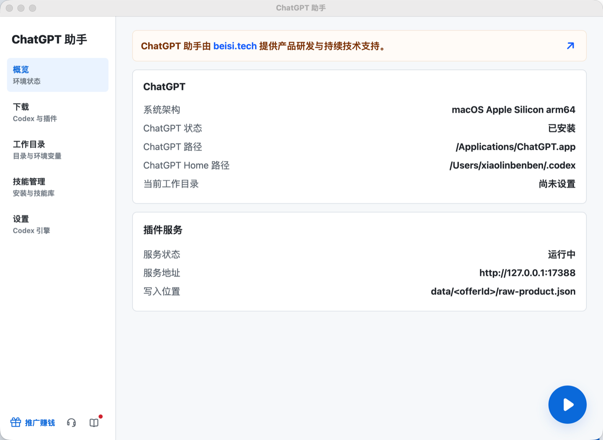
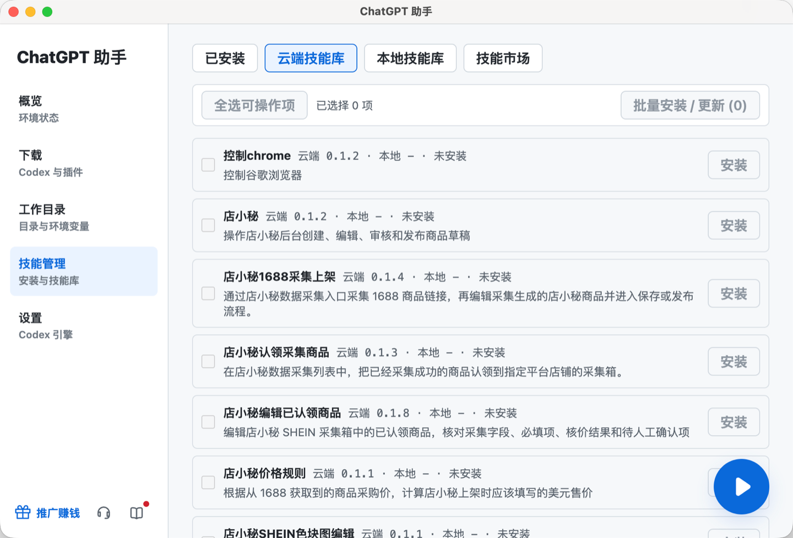
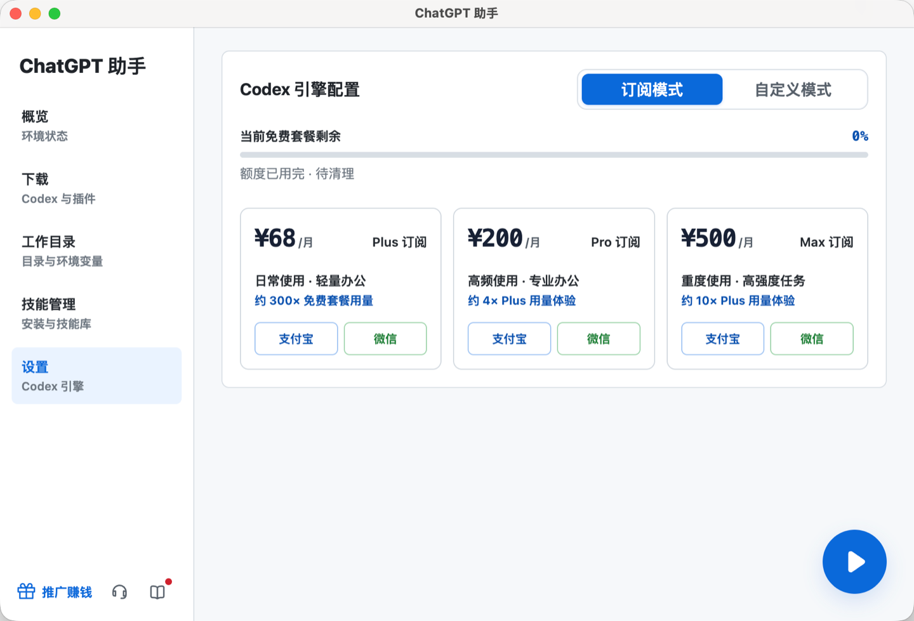

# ChatGPT 助手

**让每个人都能开箱即用地拥有顶级桌面 AI 助手。**

面向 ChatGPT 桌面端（原 Codex）用户的一站式助手。无需自行准备 API Key，无需额外网络配置，下载安装即可开始使用。

  
  
  
  

[立即下载](https://agent.terln.cn/) · [官方网站](https://agent.terln.cn/) · [推广返佣](https://agent.terln.cn/partner) · [问题反馈](https://github.com/xiaolinbenben/gpt-zhushou/issues)

  

## ChatGPT 助手是什么？

ChatGPT 助手是由 **Terln AI** 打造的 ChatGPT / Codex 桌面管理工具，专门解决新用户下载安装难、环境配置繁琐、API Key 门槛高和 Skill 管理分散等问题。

它不是另一个聊天窗口，而是你进入桌面 AI 工作流的统一入口：安装 ChatGPT、管理工作目录、配置运行环境、安装 Skills、选择模型接入方式，再一键启动 ChatGPT。相比通用型办公助手，它更专注 ChatGPT / Codex 的本地工作流，也可以作为 WorkBuddy 等产品之外的专业替代选择。

> 订阅模式无需用户自行提供 API Key；如果你已有自己的模型服务，也可以切换到自定义模式填写 Base URL 与 API Key。

## 为什么选择它？

| 开箱即用 | 一站式管理 | Skill 能力扩展 |
| --- | --- | --- |
| 订阅模式免 API Key、免手动配置网络与模型接口 | ChatGPT 下载、环境状态、工作目录和启动入口集中在一个客户端 | 云端 Skill 一键安装，本地 Skill 自由导入，支持批量安装与更新 |
| **对新手更友好** | **减少工具来回切换** | **让 ChatGPT 从“会聊天”升级为“能办事”** |

## 核心能力

| 能力 | 说明 |
| --- | --- |
| ChatGPT 下载与环境检测 | 自动识别当前系统与架构，提供匹配的 ChatGPT 桌面端、助手客户端及相关插件下载入口 |
| 一键启动 | 完成工作目录和运行环境检查后，可直接从助手启动 ChatGPT |
| 订阅与自定义双模式 | 新手选择订阅模式，无需准备 API Key；进阶用户可使用自己的 Base URL 与 API Key |
| 工作目录管理 | 选择、查看并打开当前 Codex 工作目录，让本地项目与 AI 任务保持清晰 |
| 系统指令与环境变量 | 图形化维护本机系统指令及工作目录环境变量，减少手动编辑配置文件 |
| Skill 全生命周期管理 | 集中查看已安装、云端、本地与市场 Skills，支持单个或批量安装、更新和管理 |
| 扩展工作流 | 可配合浏览器采集等插件，把网页数据同步到当前工作目录，交给 ChatGPT 继续处理 |

## 产品预览

### Skill 管理

在一个页面中管理已安装、云端、本地与市场 Skills。按工作区批量安装和更新，不再手动复制目录或反复检查版本。

  

### Codex 引擎配置

订阅模式适合希望直接使用的新手；自定义模式则保留给已有模型服务的进阶用户。客户端内可以查看套餐用量并完成购买。

  

## 三步开始

1. 前往[官方网站](https://agent.terln.cn/)，下载与你电脑匹配的安装包。
2. 安装并打开 ChatGPT 助手，在「下载」页面检查或安装 ChatGPT 桌面端。
3. 选择工作目录和需要的 Skills，使用订阅模式或自定义模式，然后点击启动按钮。

如果你只是想先体验，直接使用订阅模式即可；不需要提前购买或配置第三方 API Key。

## 系统支持

| 设备 | ChatGPT 助手 | ChatGPT 桌面端安装 | 说明 |
| --- | --- | --- | --- |
| macOS Apple Silicon | 支持 | 支持 | ChatGPT 桌面端要求 macOS 14 或更高版本 |
| macOS Intel | 支持 | 暂不支持 | 受 ChatGPT 桌面端自身平台限制，可安装助手客户端 |
| Windows x64 | 支持 | 支持 | 需 Windows 10 1809（Build 17763）或更高版本 |

安装包与最新版本统一在官网发布：

**[前往官网下载 ChatGPT 助手 →](https://agent.terln.cn/)**

## 推广计划

不仅自己用，也可以通过分享 ChatGPT 助手获得收益。

1. **申请**：在推广中心提交申请，审核通过后获得专属推广码。
2. **分享**：把你的专属链接分享给有需要的用户。
3. **结算**：受邀用户购买套餐后，系统自动记录相应返佣。

推广中心提供邀请人数、累计收益、冻结金额、可提现金额、返佣明细和提现记录等数据。具体返佣比例与结算规则以推广中心实际展示和审核结果为准。

**[申请成为推广伙伴 →](https://agent.terln.cn/partner)**

## 适合谁？

- 第一次接触 ChatGPT 桌面端，不想研究 API Key 和环境配置的用户；
- 希望让 AI 处理文件、代码、浏览器和业务流程的个人用户；
- 需要统一管理工作目录、系统指令和 Skills 的专业用户；
- 想把成熟 AI 工作流分享给客户或社群，并获得推广收益的创作者与服务商。

## 常见问题

<strong>必须有 API Key 才能使用吗？</strong>

不需要。选择订阅模式后，客户端会处理模型接入所需配置，你无需自行准备 API Key。如果已有自己的模型服务，可以主动切换到自定义模式。

<strong>需要手动配置特殊网络环境吗？</strong>

订阅模式不要求用户手动配置额外网络或模型接口，安装后按照客户端引导操作即可。

<strong>这是 OpenAI 官方产品吗？</strong>

不是。ChatGPT 助手是 Terln AI 独立开发的第三方桌面工具，用于帮助用户安装、配置和管理 ChatGPT / Codex 桌面工作流。

<strong>这个仓库包含客户端源码吗？</strong>

不包含。本仓库用于公开产品介绍、使用入口和展示素材；ChatGPT 助手客户端及相关在线服务均为闭源产品。

<strong>遇到下载安装问题怎么办？</strong>

可以在本仓库提交 [Issue](https://github.com/xiaolinbenben/gpt-zhushou/issues)，或添加开发者微信：`terlnai`。

## 联系与支持

- 官方网站：[agent.terln.cn](https://agent.terln.cn/)
- 推广中心：[agent.terln.cn/partner](https://agent.terln.cn/partner)
- 开发者微信：`terlnai`
- 问题反馈：[GitHub Issues](https://github.com/xiaolinbenben/gpt-zhushou/issues)

## 仓库与许可说明

本仓库依据 [MIT License](./LICENSE) 发布，仅包含公开说明文档与展示素材，不包含 ChatGPT 助手客户端源码。官网提供下载的客户端、在线服务及其他闭源制品不因本仓库的 MIT License 而开源或获得相同授权。

ChatGPT、Codex 与 OpenAI 是其各自权利人的商标或产品名称。本项目与 OpenAI 不存在官方隶属、授权或背书关系。

**少一点配置，多一点创造。**

[立即下载](https://agent.terln.cn/) · [加入推广计划](https://agent.terln.cn/partner)

